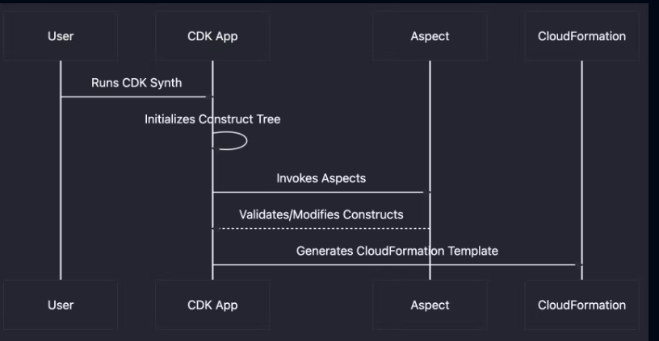
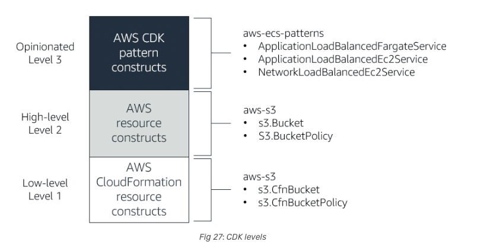

### AWS CDK Python Anatomy:

1) Project Structure
A typical AWS CDK project in Python includes the following files and directories:

   - app.py: The entry point of your CDK application. It defines the stacks to be deployed.
   - requirements.txt: Lists the Python dependencies for your project.
   - cdk.json: Configuration file for the CDK CLI.
   - stacks/: Directory containing stack definitions.

2) Core Components

  - App: The root of the CDK application. It contains one or more stacks.
  - Stack: Represents a single unit of deployment. Each stack is a collection of AWS resources.
  - Constructs: The basic building blocks of CDK applications. Constructs can represent a single resource or a higher-level abstraction.

3) Defining a Stack

Here’s an example of defining a simple stack in Python:

```python
from aws_cdk import (
    aws_s3 as s3,
    core
)

class MyStack(core.Stack):

    def __init__(self, scope: core.Construct, id: str, **kwargs) -> None:
        super().__init__(scope, id, **kwargs)

        # Define an S3 bucket
        bucket = s3.Bucket(self, "MyBucket")

app = core.App()
MyStack(app, "MyStack")
app.synth()

```

4) Using Aspects

Aspects allow you to apply operations to all constructs in a given scope. For example, you can use aspects to enforce naming conventions or apply security policies.

```python
from aws_cdk import (
    aws_iam as iam,
    core,
    Aspects,
    IAspect
)
import jsii
import uuid

@jsii.implements(IAspect)
class RoleNameAspect:
    def visit(self, node: core.IConstruct) -> None:
        if isinstance(node, iam.CfnRole):
            unique_id = str(uuid.uuid4())[:8]
            node.add_property_override("RoleName", f"delegate-test-{unique_id}")

class MyStack(core.Stack):

    def __init__(self, scope: core.Construct, id: str, **kwargs) -> None:
        super().__init__(scope, id, **kwargs)

        # Create an IAM role without specifying the name
        role = iam.Role(self, "MyRole",
                        assumed_by=iam.ServicePrincipal("lambda.amazonaws.com"))

app = core.App()
stack = MyStack(app, "MyStack")

# Apply the aspect to the entire app
Aspects.of(app).add(RoleNameAspect())

app.synth()

```

5) Deployment
To deploy your CDK application, use the CDK CLI:

```bash
cdk deploy

```


### CDK Aspects and the Synthesis Process:



Reference: https://matt.martz.codes/breaking-bad-practices-with-cdk-aspects

### CDK Construct Levels:


Reference: https://konem.blog/2021/01/17/how-to-structure-your-application-architecture-using-aws-cdk/
